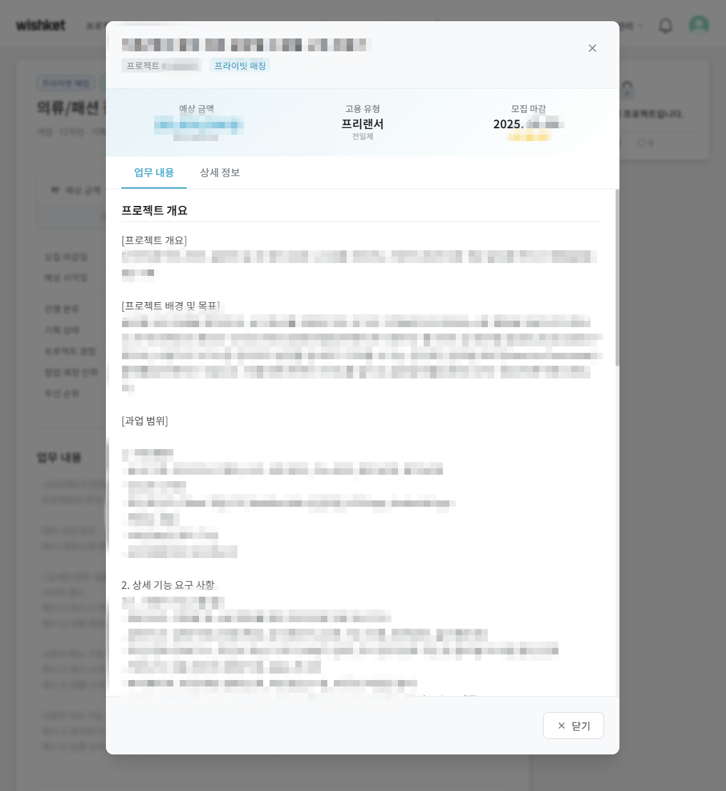

# WishView: 위시켓 프라이빗 프로젝트 뷰어

**WishView**는 [위시켓](https://www.wishket.com/)의 '프라이빗 매칭' 프로젝트에 숨겨진 상세 정보를 볼 수 있도록 도와주는 Chrome 확장 프로그램입니다.

## ✨ 주요 기능

- **자동 정보 추출**: 비공개 프로젝트 페이지에 숨겨진 JSON-LD 데이터를 자동으로 파싱하여 예산, 기간, 기술 스택 등의 핵심 정보를 추출합니다.
- **직관적인 UI**: 추출된 데이터를 깔끔하고 보기 쉬운 모달 창으로 표시하여 사용자가 빠르게 프로젝트 내용을 파악할 수 있도록 돕습니다.
- **설정 기능**: 팝업 메뉴를 통해 자동/수동 정보 표시 모드를 설정하고, 확인한 프로젝트 이력을 관리할 수 있습니다.

## 🛠️ 기술 스택 및 아키텍처

- **플랫폼**: Chrome Extension (Manifest V3)
- **언어**: 순수 JavaScript (ES2020+), 외부 라이브러리 없음
- **스타일**: Vanilla CSS3 (Flexbox, Grid)
- **아키텍처**: 모듈 기반의 클래스 구조

### 주요 구성 요소

- **`background.js`**: 확장 프로그램의 생명주기를 관리하고 백그라운드 작업을 처리하는 서비스 워커입니다.
- **`content/`**: 위시켓 프로젝트 페이지에 직접 삽입되는 스크립트와 스타일입니다.
  - `WishViewController.js`: 데이터 추출, UI 렌더링, 동적 콘텐츠 감지 등 핵심 로직을 담당합니다.
  - `ProjectDataProcessor.js`: JSON-LD 데이터 검색 및 파싱 로직을 처리합니다.
- **`popup/`**: 확장 프로그램 아이콘 클릭 시 나타나는 팝업 UI 및 관련 로직을 담당합니다.
- **`utils/`**: DOM 조작, 스토리지 관리 등 공통 유틸리티 함수를 제공합니다.

## 🚀 실행 방법

1. Chrome에서 `chrome://extensions/` 페이지 열기
2. '개발자 모드' 활성화
3. '압축해제된 확장 프로그램을 로드' 클릭
4. 프로젝트 루트 디렉터리(`wishview`) 선택
