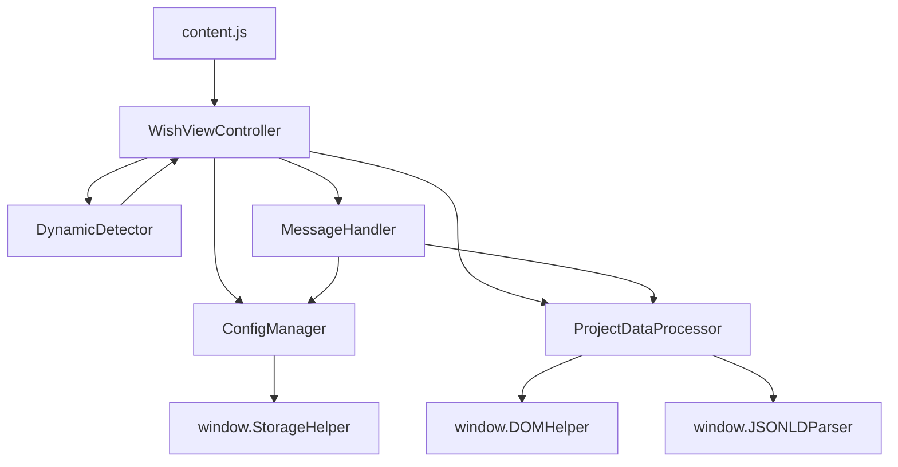

# WishView 모듈 아키텍처

WishView Content Script가 모듈별로 분리되어 관심사의 분리와 코드 재사용성을 향상시켰습니다.

## 모듈 구조

```dir
content/
├── modules/
│   ├── ConfigManager.js          # 사용자 설정 관리
│   ├── ProjectDataProcessor.js   # 프로젝트 데이터 추출 및 처리
│   ├── DynamicDetector.js        # 동적 페이지 감지
│   ├── MessageHandler.js         # Chrome Extension 메시지 처리
│   ├── WishViewController.js     # 메인 컨트롤러
│   └── README.md                 # 이 파일
├── content.js                    # 메인 진입점 (리팩토링됨)
└── content_original.js           # 원본 백업
```

## 각 모듈 설명

### 1. ConfigManager.js

- **목적**: 사용자 설정의 로드, 저장, 유효성 검사
- **주요 기능**:
  - 설정 로드 및 기본값 처리
  - 설정 유효성 검사 및 타입 안전성
  - 설정 업데이트 및 저장
- **의존성**: StorageHelper (선택적)

### 2. ProjectDataProcessor.js

- **목적**: 위시켓 프로젝트 데이터 추출 및 모달 생성
- **주요 기능**:
  - WishView 활성화 조건 확인
  - 프로젝트 데이터 추출 및 검증
  - 모달 생성 및 표시/숨김 제어
  - 통계 및 기록 업데이트
- **의존성**: JSONLDParser, DOMHelper, StorageHelper

### 3. DynamicDetector.js

- **목적**: 동적 페이지 변경 감지 및 재검사 트리거
- **주요 기능**:
  - URL 변경 감지 (History API 후킹)
  - DOM 변경 감지 (MutationObserver)
  - 프라이빗 박스 및 JSON-LD 스크립트 감지
  - 디바운스된 재검사 실행
- **의존성**: DOMHelper (디바운스 함수용, 선택적)

### 4. MessageHandler.js

- **목적**: Chrome Extension 메시지 처리 및 라우팅
- **주요 기능**:
  - Extension과의 통신 인터페이스
  - 메시지 타입별 라우팅 및 처리
  - 에러 리포팅 및 응답 관리
- **의존성**: ProjectDataProcessor, ConfigManager

### 5. WishViewController.js

- **목적**: 전체 시스템의 라이프사이클 관리 및 모듈 조정
- **주요 기능**:
  - 의존성 주입 및 모듈 초기화
  - 전체 시스템 상태 관리
  - 페이지 변경 이벤트 처리
  - 에러 처리 및 복구
- **의존성**: 모든 다른 모듈들

## 데이터 흐름



## 초기화 순서

1. **모듈 로드**: content.js에서 모든 모듈 파일 동적 로드
2. **의존성 확인**: WishViewController에서 필수 전역 객체 확인
3. **인스턴스 생성**: 각 모듈의 인스턴스 생성 및 의존성 주입
4. **설정 로드**: ConfigManager를 통한 사용자 설정 로드
5. **초기 검사**: 현재 페이지에서 WishView 활성화 조건 확인
6. **시스템 설정**: 동적 감지 및 메시지 리스너 설정

## 에러 처리

- **계층별 에러 처리**: 각 모듈에서 해당 영역의 에러 처리
- **중앙 집중식 에러 보고**: WishViewController를 통한 통합 에러 관리
- **사용자 알림**: DOMHelper를 통한 사용자 친화적 에러 메시지
- **Extension 에러 리포팅**: MessageHandler를 통한 background script 에러 전송

## 디버깅 함수

새로운 content.js는 다음 디버깅 함수들을 제공합니다:

```javascript
// WishView 상태 확인
window.getWishViewStatus()

// 강제 새로고침
window.refreshWishView()

// 시스템 재시작
window.restartWishView()
```

## 장점

1. **관심사의 분리**: 각 모듈이 명확한 책임을 가짐
2. **재사용성**: 모듈들을 독립적으로 사용 가능
3. **테스트 용이성**: 모듈별 단위 테스트 가능
4. **유지보수성**: 코드 변경 시 영향 범위 최소화
5. **확장성**: 새로운 기능 추가 시 모듈 구조 활용 가능

## 하위 호환성

- 기존 utils/ 폴더의 헬퍼 클래스들과 완전 호환
- 기존 Extension API와 메시지 형식 유지
- 사용자 설정 및 데이터 구조 동일 유지

## 성능 고려사항

- **지연 로딩**: 필요한 모듈만 순차적으로 로드
- **디바운스**: 과도한 재검사 방지를 위한 디바운스 적용
- **메모리 관리**: 적절한 정리 함수로 메모리 누수 방지
- **DOM 최적화**: MutationObserver 최적화로 성능 향상
